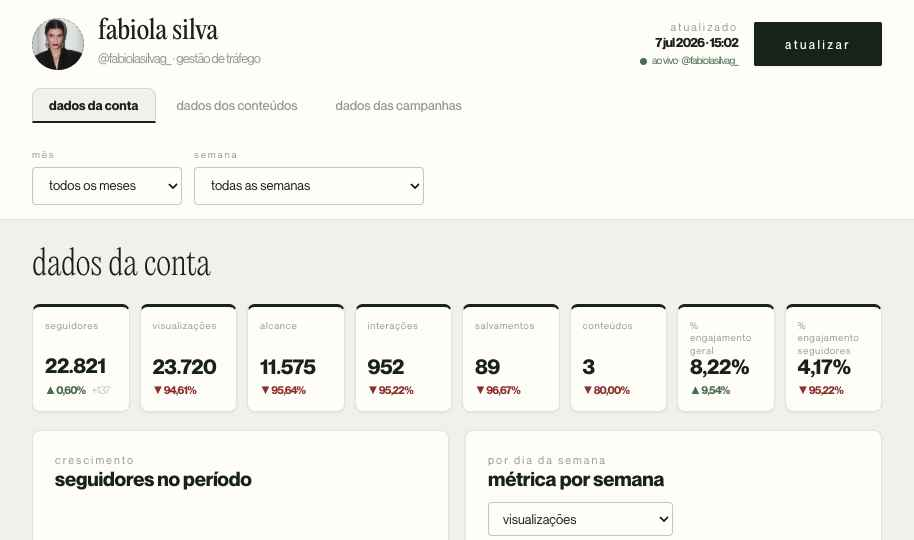

# Dashboard de Análise — Fabiola Silva

Painel de performance do Instagram **@fabiolasilvag_** e das campanhas de **tráfego pago** (Meta/Facebook Ads), com dados servidos ao vivo pelos conectores da **Windsor.ai**.



---

## O que é

Aplicação de **página única** que roda 100% no navegador, **sem build/bundler**. A interface é um único **Design Component** (`Dashboard.dc.html`) renderizado por um runtime React leve (`support.js`). Os gráficos usam **Chart.js** (via CDN).

O painel tem três páginas:

- **Dados da conta** — KPIs do período (seguidores, visualizações, alcance, interações, salvamentos, conteúdos, % de engajamento), crescimento de seguidores, métricas por dia da semana e demografia da audiência (idade, gênero, cidade).
- **Dados dos conteúdos** — grade de todas as publicações do período, com **capa real** (reel usa a capa do reels; carrossel usa o 1º card), tipo, data e métricas estilo Instagram.
- **Dados das campanhas** — duas abas por **objetivo**: **Tráfego** e **Leads**. Cada uma traz o funil de conversão do Meta Ads + tabelas de anúncios e conjuntos. Os criativos linkam para o post no Instagram.

---

## Fontes de dados

- **Instagram (Windsor.ai)** — perfil, série diária (views, alcance, interações, salvamentos), saldo de seguidores, demografia e publicações. Handle configurado em `HANDLE`.
- **Meta Ads (Windsor.ai)** — contas `659288450012652` e `1859662568094211`. As campanhas entram **separadas por objetivo** (Tráfego = `LINK_CLICKS`/`TRAFFIC`; Leads = `OUTCOME_LEADS`), somando as duas contas, e apenas as com **1ª veiculação a partir de set/2025** (`ADS_START`).

> A demografia, as capas das publicações e o histórico de anúncios ficam em **cache no navegador** (`localStorage`); o botão **Atualizar** relê as fontes ao vivo (Meta Ads faz busca incremental dos últimos dias e mescla com o histórico).

---

## Configuração

Todas as chaves ficam no `constructor` da classe `Component`, dentro de `Dashboard.dc.html`:

| Flag | Padrão | O que faz |
|------|--------|-----------|
| `WINDSOR_KEY` | — | Chave da API Windsor.ai (visível no cliente). |
| `HANDLE` | `fabiolasilvag_` | Perfil do Instagram lido ao vivo. |
| `ADS_ACCOUNTS` | 2 contas | IDs das contas de anúncio do Meta. |
| `ADS_START` | `2025-09-01` | Só entram campanhas com 1ª veiculação ≥ esta data. |
| `LIVE_INSTAGRAM` | `true` | Puxa o Instagram orgânico ao vivo. |
| `LIVE_ADS` | `true` | Puxa o Meta Ads ao vivo. |
| `TEMPLATE_MODE` | `true` | Preenche vendas/turbinamento com dados de exemplo (ainda sem fonte real). Com `LIVE_INSTAGRAM`/`LIVE_ADS` ligados, o Instagram e o Meta Ads continuam ao vivo. |

> A `WINDSOR_KEY` é enviada pelo navegador — trate o repositório como **privado** ou substitua por uma chave restrita.

---

## Como rodar localmente

É estático — basta servir os arquivos:

```bash
python3 -m http.server 8000
# acesse http://localhost:8000/  (o vercel.json redireciona a raiz p/ Dashboard.dc.html;
# localmente, abra http://localhost:8000/Dashboard.dc.html)
```

> Abrir via `file://` falha (carregamento de fontes/estado) — use um servidor estático.

---

## Deploy no Vercel

O projeto é estático puro; **não há passo de build**.

**Pela interface (GitHub):**
1. Suba este repositório para o GitHub.
2. No Vercel → *Add New… → Project* → importe o repo.
3. Framework Preset: **Other**. Build Command: *(vazio)*. Output Directory: *(vazio / raiz)*.
4. Deploy. O `vercel.json` já reescreve `/` → `/Dashboard.dc.html`, então a URL fica limpa (sem `/Dashboard.dc.html` no fim).

**Pela CLI:**
```bash
npm i -g vercel
vercel        # preview
vercel --prod # produção
```

---

## Estrutura

```
.
├── Dashboard.dc.html          Aplicação — toda a UI e a lógica de dados
├── support.js                 Runtime do Design Component (React leve) — não editar
├── image-slot.js              Componente do avatar (foto do perfil arrastável)
├── .image-slots.state.json    Foto do perfil já posicionada (servida ao vivo)
├── vercel.json                Rewrite p/ URL limpa na raiz
├── _ds/
│   └── l-marques-design-system-…/   Tokens de marca (cores, tipografia, fontes)
│       ├── tokens/*.css
│       ├── styles.css
│       └── assets/fonts/
└── docs/
    ├── ARQUITETURA.md         Referência técnica (modelo de dados, fórmulas, cache)
    └── preview.png
```

---

## Stack

HTML + React 18 (via runtime do Design Component) + Chart.js. Sem JSX, sem bundler, sem dependências de build.
